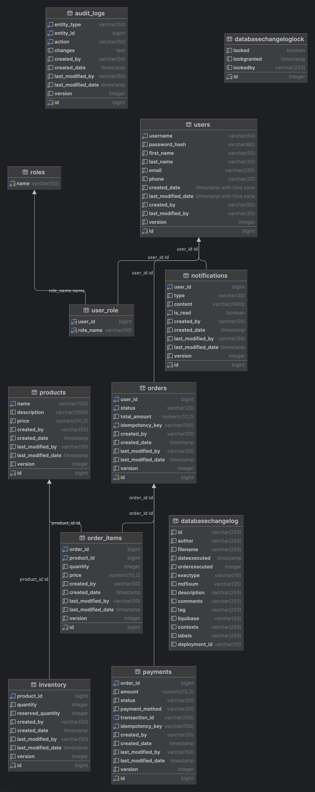

# E-commerce Order Processor


A Spring Boot application for processing e-commerce orders with a focus on reliability, scalability, and security.

## Table of Contents

- [Getting Started](#getting-started)
- [Project Structure](#project-structure)
- [Features](#features)
- [Technologies](#technologies)
- [Database Management](#database-management)
    - [Database Schema](#database-schema)
- [Concurrency Control](#concurrency-control)
- [Asynchronous Processing](#asynchronous-processing)
- [API Documentation](#api-documentation)
- [Postman Collection](#postman-collection)
- [WebSocket Testing](#websocket-testing)
- [Authentication and Authorization](#authentication-and-authorization)
- [Distributed Tracing](#distributed-tracing)
- [Rate Limiting](#rate-limiting)
- [Configuration Profiles](#configuration-profiles)
- [Testing](#testing)
- [CI/CD Pipeline](#cicd-pipeline)

## Getting Started

### Prerequisites

- JDK 21
- Docker and Docker Compose

### Running Locally

```bash
./gradlew bootRun
```

### Running with Docker

```bash
cd docker
docker-compose up
```

### Building from Source

```bash
./gradlew build
```

### Running Tests

```bash
./gradlew test
```

### Generating API Documentation

Start the application and navigate to:

```
http://localhost:8080/swagger-ui/index.html
```

## Project Structure

The application follows a modular architecture with clear separation of concerns:

```
src/
├── main/
│   ├── java/
│   │   └── com/gitthub/youssefagagg/ecommerceorderprocessor/
│   │       ├── config/           # Application configuration
│   │       ├── dto/              # Data Transfer Objects
│   │       ├── entity/           # JPA entities
│   │       ├── exception/        # Exception handling
│   │       ├── mapper/           # MapStruct object mappers
│   │       ├── repository/       # Spring Data JPA repositories
│   │       ├── security/         # Security configuration and JWT
│   │       ├── service/          # Business logic services
│   │       ├── util/             # Utility classes
│   │       └── web/              # REST controllers and filters
│   └── resources/
│       ├── db/changelog/         # Liquibase database migrations
│       └── application*.yaml     # Application configuration files
└── test/
    └── java/                     # Test classes
```

## Features

- **User Management**: Registration, authentication, and profile management
- **Product Management**: CRUD operations for products and inventory
- **Order Processing**: Order creation, payment processing, and status tracking
- **Inventory Management**: Stock tracking with concurrency control
- **Payment Processing**: Secure payment handling with idempotency
- **Notification System**: Asynchronous notifications for order status changes
- **Audit Logging**: Comprehensive audit trail for all operations
- **RESTful API**: Well-designed API with rate limiting and documentation
- **WebSocket Support**: Real-time updates for order status changes
- **Security**: JWT-based authentication and authorization

## Technologies

- **Java 21**: Latest LTS version with virtual threads support
- **Spring Boot 3.5.0**: Modern application framework
- **Spring Security**: Authentication and authorization
- **Spring Data JPA**: Database access with Hibernate
- **Spring WebSocket**: Real-time communication
- **PostgreSQL**: Relational database
- **Liquibase**: Database schema migration and version control
- **MapStruct**: Type-safe bean mapping
- **Bucket4j**: Token bucket algorithm for rate limiting
- **Caffeine**: High-performance caching
- **io.micrometer**: Distributed tracing
- **Springdoc OpenAPI**: API documentation with Swagger UI
- **JUnit 5**: Testing framework
- **Testcontainers**: Integration testing with real databases
- **JaCoCo**: Code coverage reporting
- **Docker**: Containerization
- **GitHub Actions**: CI/CD pipeline

## Database Management

### SQL Migration with Liquibase

The application uses Liquibase for database schema migration and version control. This provides:

- **Version Control**: All database changes are tracked and versioned
- **Rollback Capability**: Changes can be rolled back if needed
- **Context-Specific Migrations**: Different migrations for different environments
- **Automated Execution**: Migrations run automatically on application startup

The migration files are organized as follows:

- `master.yaml`: Main changelog that includes all other changelogs
- `001_users_schema_migrations.yaml`: User-related tables
- `002_product_order_audit_logs_notification_schema_migrations.yaml`: Product, order, audit, and notification tables
- `003_add_dummy_data.sql`: Test data for local and development environments

### Test Data

Test data is loaded only in local and development environments using context-specific Liquibase migrations. This ensures
that production environments remain clean while developers have realistic data to work with.

### Database Schema

The application uses a relational database schema designed to support all the features of the e-commerce platform. The
schema includes tables for users, products, inventory, orders, payments, notifications, and audit logs.



The main entities and their relationships:

- **Users**: Stores user account information and authentication details
- **Products**: Contains product information including name, description, and price
- **Inventory**: Tracks product stock levels with quantity and reserved quantity
- **Orders**: Stores order information with status and total amount
- **Order Items**: Links orders to products with quantity and price
- **Payments**: Records payment transactions for orders
- **Notifications**: Stores user notifications for various events
- **Audit Logs**: Tracks all changes to entities for compliance and debugging

All tables include audit fields (created_by, created_date, last_modified_by, last_modified_date) and version fields for
optimistic locking.

## Concurrency Control

### Optimistic Locking

The application uses optimistic locking to prevent concurrent modifications of the same data:

- All entity classes include a `version` field annotated with `@Version`
- When an entity is updated, the version is checked and incremented
- If the version doesn't match (indicating another process modified the data), an `OptimisticLockException` is thrown
- This prevents data corruption without the overhead of pessimistic locking

### Idempotency for Orders

To prevent duplicate order creation, the application uses idempotency keys:

- Each order request must include a unique idempotency key
- If a request with the same idempotency key is received, it will be blocked until the first request is processed
- This ensures that network issues or retries don't result in duplicate orders
- The same approach is used for payment processing

## Asynchronous Processing

The application uses asynchronous processing for non-critical operations:

- **Notifications**: Order status changes trigger asynchronous notifications
- **Audit Logging**: All operations are logged asynchronously to avoid impacting performance
- **Task Executor Configuration**: Configurable thread pools for async tasks
- **Profile-Specific Settings**: Different async configurations for local and production environments

## API Documentation

The API is documented using Springdoc OpenAPI (Swagger):

- **Interactive Documentation**: Available at `/swagger-ui/index.html`
- **OpenAPI Specification**: Available at `/v3/api-docs`
- **Endpoint Documentation**: All endpoints are documented with descriptions, parameters, and response types
- **Authentication**: The documentation includes information about authentication requirements

## Postman Collection

The repository includes a Postman collection and environment for testing the API:

### Importing the Collection

1. Download [Postman](https://www.postman.com/downloads/) if you don't have it installed
2. In Postman, click on "Import" in the top left corner
3. Select the `E-commerce.postman_collection.json` and `e-commerce-local-env.postman_environment.json` files from the
   repository
4. The collection and environment will be imported into Postman

### Collection Overview

The Postman collection is organized into the following folders:

- **E-commerce Auth API**: User registration and authentication
- **E-commerce User API**: User profile management
- **E-commerce Product Admin API**: Product management (admin only)
- **E-commerce Product API**: Product browsing (public)
- **E-commerce Order API**: Order creation and management
- **E-commerce Order Admin API**: Order administration (admin only)

## WebSocket Testing

The application includes a WebSocket client HTML file that can be used to test the WebSocket functionality:

### Using the WebSocket Client

1. Start the application locally
2. Open the `WebSocketClient.html` file in a web browser
3. Configure the connection:
  - Server URL: `ws://localhost:8080/ws` (default)
  - Username: Enter your username (e.g., `admin`)
  - JWT Token: Paste a valid JWT token (obtain from login API)
4. Click "Connect" to establish a WebSocket connection
5. Subscribe to topics by checking the corresponding checkboxes
6. View received messages in the Messages section

### Available Topics

The WebSocket client supports subscribing to the following topics:

- `/topic/inventory`: Inventory updates
- `/topic/orders/{username}`: Order updates for a specific user
- `/topic/notifications/{username}`: Notifications for a specific user
- `/topic/admin/orders/status`: Order status changes (admin only)
- `/topic/admin/inventory/low-stock`: Low stock alerts (admin only)

### Authentication

## Authentication and Authorization

### JWT Authentication

The application uses JSON Web Tokens (JWT) for authentication:

- **Token-Based**: Stateless authentication using signed JWTs
- **Role-Based Access Control**: Different endpoints require different roles
- **Configurable Expiration**: Token expiration time is configurable
- **Secure Implementation**: Uses industry-standard libraries and practices

JWT configuration is customizable through application properties:

```yaml
jwt:
  secret: ${JWT_SECRET:LocalRouhMatrouhSecretKeyLocalRouhMatrouhSecretKey}
  expiration: 86400 # 1 day in seconds
  issuer: ecommerce-order-processor
```

## Distributed Tracing

The application uses Micrometer Tracing for distributed tracing:

- **Trace ID**: Each request is assigned a unique trace ID
- **Span ID**: Operations within a request are assigned span IDs
- **Error Responses**: Trace IDs are included in error responses for easier debugging
- **Logging**: Trace and span IDs are included in log messages
- **W3C Trace Context**: Follows the W3C trace context standard for interoperability

## Rate Limiting

The API implements rate limiting to protect against abuse and ensure fair usage:

- **Token Bucket Algorithm**: Uses Bucket4j for efficient rate limiting
- **IP-Based Limiting**: Rate limits are applied per client IP address
- **Endpoint-Specific Limits**: Different endpoints have different rate limits
- **Configurable Limits**: Rate limits are configurable through application properties
- **Response Headers**: Includes headers with remaining tokens and retry information

Default rate limits:

- Default rate limit: 20 requests per minute
- Authentication endpoints:
  - `/api/v1/auth/login`: 5 requests per minute
  - `/api/v1/auth/register`: 3 requests per minute
- Admin endpoints: 10 requests per minute
- Public product endpoints: 30 requests per minute

When a rate limit is exceeded, the API returns a 429 Too Many Requests response with information about when to retry.

### Rate Limit Headers

The API includes the following headers in responses:

- `X-Rate-Limit-Remaining`: Number of requests remaining in the current time window
- `X-Rate-Limit-Retry-After-Seconds`: Seconds until the rate limit resets

### Configuring Rate Limits

Rate limits can be configured in the `application.yaml` file:

```yaml
rate-limit:
  capacity: 20              # Default maximum requests
  refill-tokens: 20         # Default tokens refilled per period
  refill-duration: 60       # Default period in seconds

  endpoints:
    "/api/v1/auth/login": # Endpoint-specific configuration
      capacity: 5
      refill-tokens: 5
      refill-duration: 60
```

## Configuration Profiles

The application supports different configuration profiles:

- **Local**: Development environment with Docker Compose integration
- **Dev**: Development server environment
- **Prod**: Production environment with optimized settings

Profile-specific configurations include:

- Database connection settings
- Logging levels
- Async task executor settings
- Rate limiting parameters
- WebSocket allowed origins
- Server performance tuning

## Testing

The application has comprehensive test coverage:

- **Unit Tests**: Tests for individual components with mocked dependencies
- **Integration Tests**: Tests for component interactions with real dependencies
- **API Tests**: Tests for REST endpoints using MockMvc
- **Database Tests**: Tests for database operations using Testcontainers
- **Code Coverage**: JaCoCo reports for code coverage analysis

## CI/CD Pipeline

The application uses GitHub Actions for continuous integration and delivery:

- **Automated Builds**: Builds on push to main branch and pull requests
- **Testing**: Runs all tests and generates coverage reports
- **Docker Image**: Builds and pushes Docker images to GitHub Container Registry
- **Multi-Platform Support**: Builds for both AMD64 and ARM64 architectures
- **Artifacts**: Uploads test and coverage reports as artifacts
